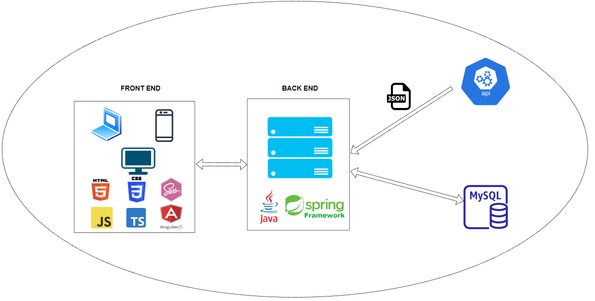

  
# Anteproyecto - Space Gaze
  
## Índice

- [Descripción del problema](#descripción-del-problema)
- [Objetivos](#objetivos)
- [Arquitectura y tecnologías a utilizar](#arquitectura-y-tecnologías-a-utilizar)
- [Boceto de la solución](#boceto-de-la-solución)

### Descripción del problema

A menudo, la astronomía es vista como una disciplina exclusiva para expertos y académicos, y se subestima su relevancia para el público en general.

Sin embargo, la astronomía es fundamental para entender nuestro lugar en el universo, nuestra evolución como especie y el impacto que nuestras acciones pueden tener en el medio ambiente y en otros seres vivos.

Además, la astronomía también es clave para el desarrollo tecnológico y la exploración espacial, áreas que tienen un gran impacto en nuestra economía y en la vida cotidiana de las personas.

### Objetivos

El proyecto fue concebido con el objetivo de fomentar el interés público en la astronomía y áreas relacionadas, proporcionando contenido confiable y atractivo que destaque las últimas investigaciones y descubrimientos en este campo. La plataforma está diseñada para ser fácil de usar e interactiva, fomentando a los visitantes a explorar y aprender más sobre el universo en el que vivimos.

A través de esta iniciativa, Space Gaze tiene como objetivo fomentar la colaboración y el intercambio de conocimientos entre la comunidad científica en general, así como facilitar la participación y comprensión del público en general en el fascinante campo de la astronomía.

### Arquitectura y tecnologías a utilizar

La web tendrá las siguientes funcionalidades (preliminar):

- Mostrar información detallada sobre distintos cuerpos celestes.
- Permitir a los usuarios buscar y filtrar información por distintos criterios, como nombre, tipo de objeto, tamaño, distancia, entre otros.
- Añadir a favoritos los cuerpos celestes a los que deseen realizar un seguimiento más detallado.
- Proporcionar un calendario sobre eventos astronómicos, como eclipses, alineaciones planetarias y lluvias de meteoros.
- Artículos y noticias sobre los últimos descubrimientos, investigaciones y eventos relacionados con la astronomía.
- Foros de discusión donde los visitantes podrán interactuar con otros entusiastas de la astronomía y compartir ideas e información.

Las tecnologías usadas serán:

- HTML para la estructura.
- CSS y SASS para el estilo.
- Javascript y Typescript con Angular para el Front end.
- Java con Spring para el Back end.
- Base de datos MySQL.
- Despliegue con Docker.

### Boceto de la solución

